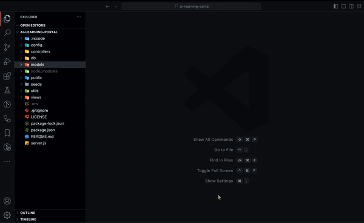
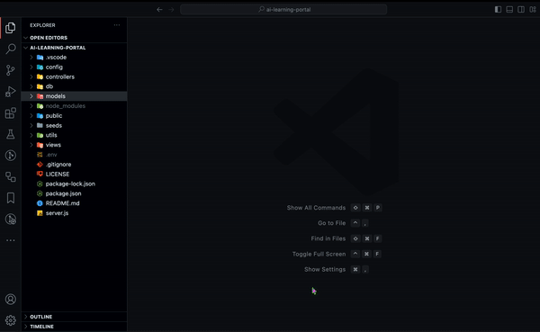
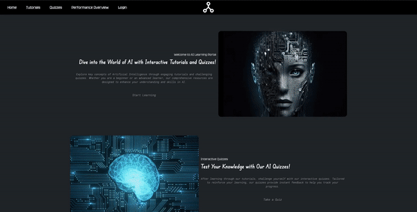

# AI Learning Portal: Interactive AI and Coding Tutorials

## Description

An interactive platform dedicated to teaching fundamental AI concepts through hands-on tutorials. This app provides a unique learning experience, combining theoretical knowledge with practical coding exercises, making AI learning accessible and engaging.

## Table of Contents

- [Installation](#installation)
- [Configuration](#configuration)
- [Database Setup](#database-setup)
- [Usage](#usage)
- [Interactive Features](#interactive-features)
- [API Routes](#api-routes)
- [Demonstration](#demonstration)
- [Contributing](#contributing)
- [License](#license)
- [Contact](#contact)

## Installation

Clone the repository to your local machine:

```
git clone git@github.com:Jackspence6/ai-learning-portal.git
```

Navigate to the application directory and install dependencies:

```
npm install
```

## Configuration

Set up your environment variables. Create a `.env` file in the root directory with the following content:

```
DB_NAME="aiPortal_db"
DB_USER="[your_mysql_username]"
DB_PW="[your_mysql_password]"
SESS_SECRET="[your_session_secret]"
```

## Database Setup

Create the database using the provided schema:

```
source db/schema.sql
```

Seed the database with initial data:

```
npm run seed
```

## Usage

Start the server and sync the Sequelize models to the MySQL database:

```
npm start
```

The application will be running on `localhost:3001`.

## Interactive Features

### Dynamic Content Management

- Efficient retrieval of quizzes based on specific topics or IDs.
- Customizable learning experience with a variety of tutorials and quizzes.

### User Authentication and Account Management

- Secure user authentication system for personalized access.
- Account management capabilities allowing users to log in and out of the platform.

### Comprehensive Learning Path

- A structured learning path through various AI and Machine Learning topics.
- Progress tracking to help users pick up where they left off.

### Responsive Quiz Interface

- Quizzes adaptively respond to user inputs, providing an engaging learning experience.
- Option to revisit and review quiz content for improved learning.

### Seamless Navigation and User Experience

- Intuitive navigation through different sections of the application.
- User-friendly interface catering to both beginners and advanced learners.

## API Routes

### User Authentication and Management Routes

- `POST /api/users` - Register a new user.
- `POST /api/users/login` - Authenticate and log in a user.
- `GET /api/users/logout` - Log out a user.

### User Progress Tracking Routes

- `POST /api/progress` - Save user quiz results and quiz status (requires authentication).
- `GET /api/progress` - Fetch user progress by user ID (requires authentication).

### Quiz Routes

- `GET /api/quizzes` - Retrieve all quizzes.
- `GET /api/quizzes/:id` - Retrieve a specific quiz.

### Tutorial Routes

- `GET /api/tutorials` - Retrieve all tutorials.

## Demonstration

### DB Setup



### App Usage



### New User Sign-up


### Existing User Login


### Tutorial Demonstration


### Quiz Demonstration



### User Performance Overview (using seed data)


## Contributing

Contributions are welcome. For major changes, please open an issue first to discuss your suggestions or improvements.

## License

[MIT](LICENSE)

## Contact

GitHub: [Jackspence6](https://github.com/Jackspence6)  
Email: [jackspence.dev@gmail.com](mailto:jackspence.dev@gmail.com)
